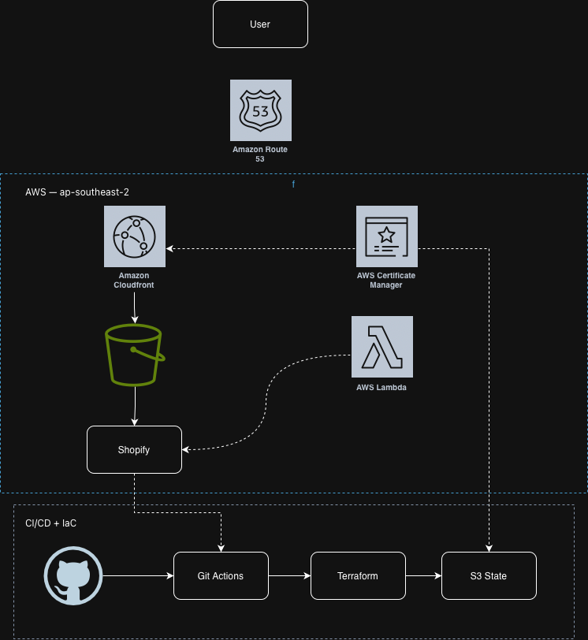

# The Collective House — E-Commerce Platform

A production e-commerce website built for a Melbourne-based wholesale and retail store, powered by a modern cloud-native stack on AWS.

🌐 **Live site:** https://thecollectivehouse.com.au

---

## Architecture Overview



User → CloudFront (CDN + HTTPS)

→ S3 Bucket (Next.js static export)

→ Shopify Storefront API (Products, Cart, Checkout)
GitHub → GitHub Actions (CI/CD)

→ Build Next.js → Deploy to S3 → Invalidate CloudFront
Terraform → S3 + CloudFront + IAM (Infrastructure as Code)

---

## Tech Stack

| Layer | Technology |
|---|---|
| Frontend | Next.js 16 (App Router, static export) |
| Styling | Tailwind CSS |
| E-commerce | Shopify Storefront API (Headless) |
| CDN | AWS CloudFront |
| Storage | AWS S3 |
| IaC | Terraform |
| CI/CD | GitHub Actions |
| DNS | AWS Route53 (ready for custom domain) |

---

## Features

- Product catalogue with live Shopify data
- Product detail page with image gallery and quantity selector
- Cart with add/update/remove items (persisted via localStorage)
- Shopify-hosted checkout (PCI-compliant, secure)
- Fully static site — no server required, scales automatically
- Auto-deploy on every push to `main`

---

## Infrastructure (Terraform)

All AWS infrastructure is managed as code under `/terraform`:

- **S3 bucket** — stores static build output, private access only
- **CloudFront distribution** — serves site globally with HTTPS, Origin Access Control
- **IAM roles** — least-privilege access for Terraform deployer and GitHub Actions
- **Terraform state** — stored remotely in S3 with versioning enabled

---

## CI/CD Pipeline

On every push to `main` that touches `frontend/`:

1. GitHub Actions checks out code
2. Installs Node.js dependencies
3. Builds Next.js static export
4. Syncs output to S3 (`aws s3 sync`)
5. Invalidates CloudFront cache

---

## Local Development

```bash
# Clone repo
git clone https://github.com/kimthu123/flower-shop.git
cd flower-shop/frontend

# Install dependencies
npm install

# Set up environment variables
cp .env.local.example .env.local
# Fill in NEXT_PUBLIC_SHOPIFY_STORE_DOMAIN and NEXT_PUBLIC_SHOPIFY_STOREFRONT_TOKEN

# Run dev server
npm run dev
```

---

## Deploy Infrastructure

```bash
cd terraform
terraform init
terraform plan
terraform apply
```

Requires AWS credentials configured with appropriate IAM permissions.

---

## Project Structure
flower-shop/

├── terraform/              # AWS infrastructure as code

│   ├── main.tf

│   ├── variables.tf

│   ├── outputs.tf

│   └── modules/

│       ├── s3/

│       ├── cloudfront/

│       └── route53/

├── frontend/               # Next.js application

│   ├── app/

│   │   ├── page.tsx        # Homepage

│   │   ├── about/          # About page

│   │   ├── cart/           # Cart page

│   │   ├── products/       # Product detail pages

│   │   ├── components/     # Shared components (Navbar)

│   │   └── context/        # Cart context (global state)

│   └── lib/

│       └── shopify.ts      # Shopify Storefront API client

└── .github/

└── workflows/

└── deploy-frontend.yml

---

## Environment Variables

| Variable | Description |
|---|---|
| `NEXT_PUBLIC_SHOPIFY_STORE_DOMAIN` | Shopify store domain (e.g. `store.myshopify.com`) |
| `NEXT_PUBLIC_SHOPIFY_STOREFRONT_TOKEN` | Shopify Storefront API public access token |
| `AWS_ACCESS_KEY_ID` | AWS credentials (GitHub Actions secret) |
| `AWS_SECRET_ACCESS_KEY` | AWS credentials (GitHub Actions secret) |
| `CLOUDFRONT_DISTRIBUTION_ID` | CloudFront distribution ID (GitHub Actions variable) |

---

## Author

Built and maintained by [Kim Thu Tran](https://github.com/kimthu123)  
Cloud & DevOps — Melbourne, AU
